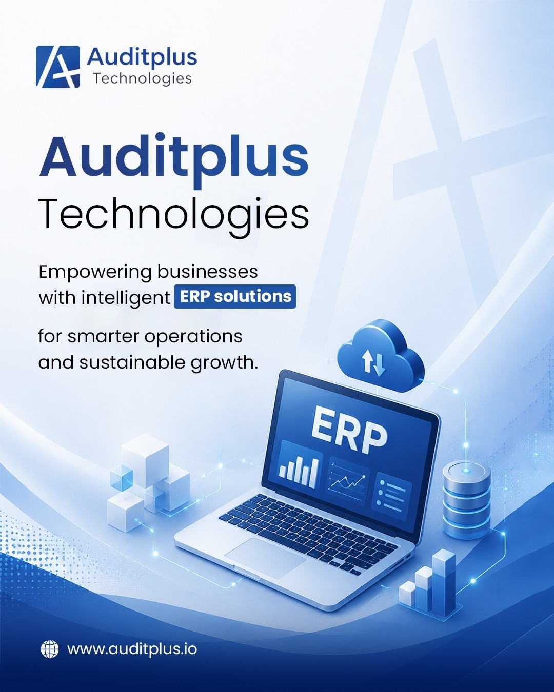

BNI Meeting, Korkai, held on 20-08-26 at Alagar Mahal, Tuticorin. 
In this meeting we presented about some of our auditplus erp application's features
like erp, customization, connector app, developer portal, ai integration, partner program,
and hosting provisions.
{/* truncate */}

Topics Discussed in this meetings are,

1. [Auditplus ERP](#auditplus-erp)
2. [Customization](#customization)
3. [Connector App](#connector-app)
4. [Developer Portal](#developer-portal)
5. [AI Integration](#ai-integration)
6. [Partner Program](#partner-program)
7. [Self Hosted / Cloud Hosted](#self-hosted--cloud-hosted)

## Auditplus ERP

`Auditplus ERP` is a Complete ERP Solution, `Auditplus ERP` (Enterprise Resource Planning) is a centralized software system 
that integrates core business processes — like accounting, outstandings, financial reports, gstr1 filling, sales, 
stock management, and customer service into a unified platform.

Its purpose is to streamline operations, improve data accuracy, and enable real-time decision-making 
by providing a single source of truth across departments.

## Customization

`Auditplus ERP` has standard modules to run your core business. apart from that, 
you can customize the application in variours aspects using our extension libraries,
you can download extensions from our marketplace and plug it to the core application.

* Accounting    
    * Outstanding Overview
    * GSTR1 Filling
    * Financial Reports
    * Tally Exports
    * POS Settlements
* Stock Management
    * Offers & Rewards Management 
    * Scheduled Drug Classification
    * Sales Reminder
    * Reorder Analysis
    * Expiry / Non-movement / Stock Analysis
    * Stock Transfers within Branches
    * Packaging & Shipping & Delivery

## Connector App

Through the `Auditplus Connector App`, 
* Customers can view their outstandings, sales orders, previous sales in our `Auditplus ERP`.
* Vendor can view their purchase orders, inventory flow and do refill in our `Auditplus ERP`.
* Partners (Clients/Sellers) can post their stock in `Auditplus Online`.

## Developer Portal
Through `Auditplus Developer Portal`,
* Developers can write their own customized extension to our `Auditplus ERP` application,
* Developers can post free and paid extensions.
* Earn money via customized extensions.

## AI Integration
Through `Auditplus AI`, our clients can give ai prompts to get informations regarding auditplus stocks and accounts and more.
With `Auditplus AI` you can do tasks like creating masters, and transactions.

## Partner Program
Auditplus Technologies has a way to empower youngsters by making them as an entrepreneur. 
You can setup your own company by joining this `Partner Program`.
 We will teach you how to setup environments required to run `Auditplus ERP` in cloud & On-Premise.
and also will teach you how to work in `Auditplus ERP` application.
 We support you to grow by selling `Auditplus ERP` & give support your clients. 
Only you need is consistent involvement.

## Self Hosted / Cloud Hosted
You can setup `Auditplus ERP` server in cloud and On-Premise.
We will support you to setup the environment.

